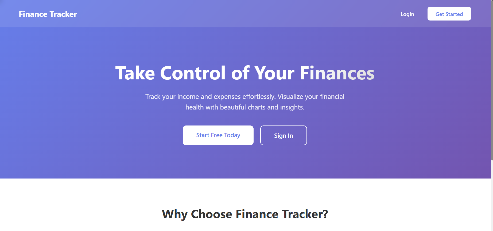
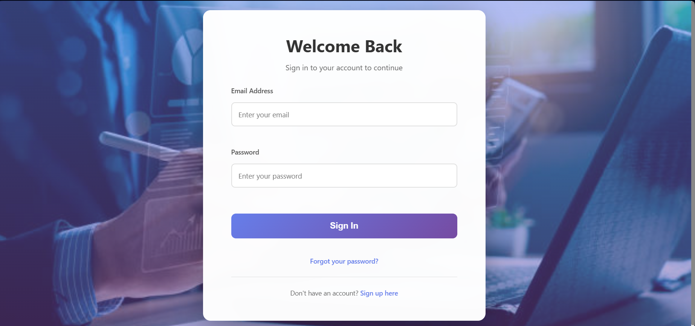
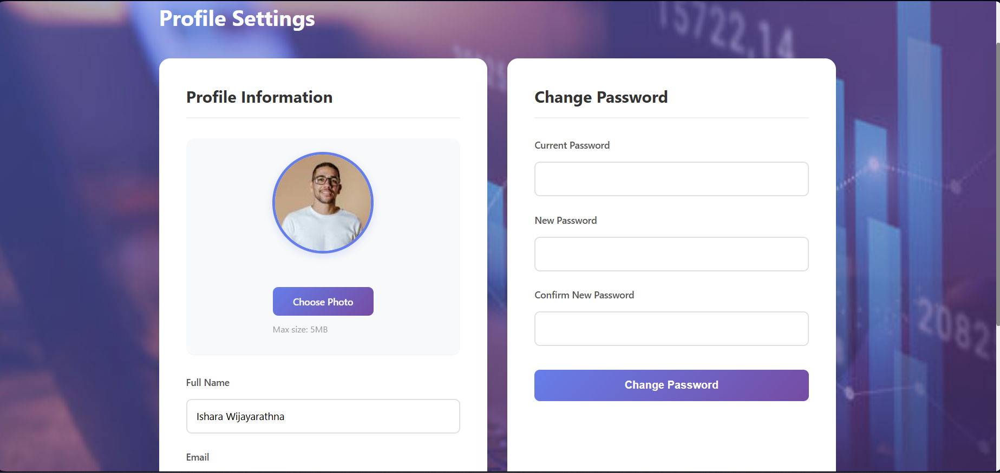
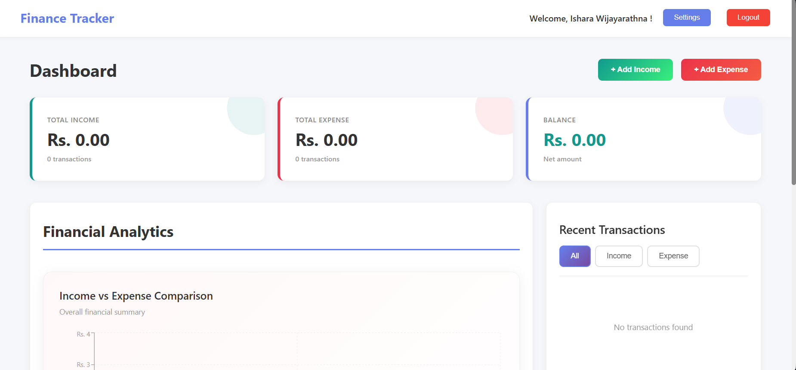
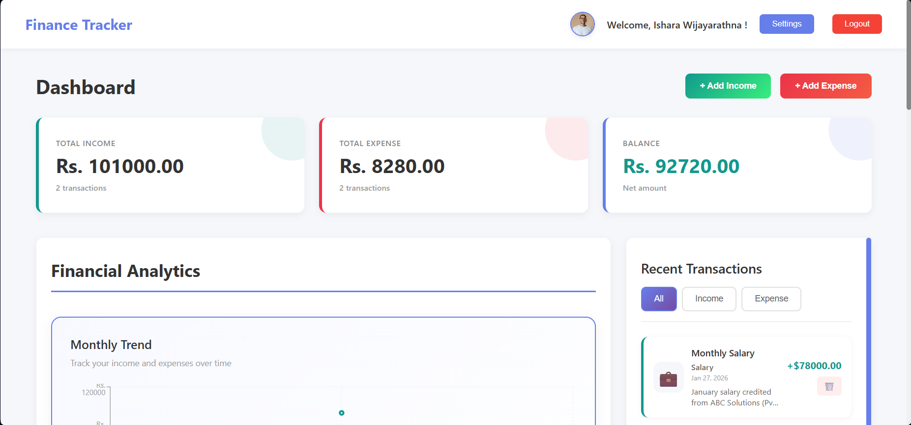

# Finance Tracker Web Application







A full-stack web application for tracking income and expenses with beautiful visualizations and analytics.

##  Features

- **User Authentication**: Secure signup and login system with JWT tokens
- **Dashboard**: Comprehensive overview of financial health
- **Income Tracking**: Add, view, and delete income transactions with categories
- **Expense Tracking**: Manage expenses with multiple categories
- **Visual Analytics**: Beautiful charts showing income vs expense and category breakdowns
- **Transaction Management**: View, filter, and delete transactions
- **Responsive Design**: Works seamlessly on desktop and mobile devices

## Tech Stack

### Backend
- **Python**: Flask framework
- **Database**: MongoDB (Cloud)
- **Authentication**: JWT (JSON Web Tokens)
- **Password Security**: bcrypt

### Frontend
- **React**: Modern UI library
- **React Router**: Client-side routing
- **Recharts**: Data visualization
- **Axios**: HTTP client
- **CSS3**: Custom styling with gradients and animations

## Prerequisites

Before running this application, make sure you have:

- Python 3.8+ installed
- Node.js 14+ and npm installed
- MongoDB account (using provided connection string)

##  Installation & Setup

### Backend Setup

1. Navigate to the backend directory:
```bash
cd backend
```

2. Create a virtual environment (recommended):
```bash
python -m venv venv
```

3. Activate the virtual environment:
- Windows:
```bash
venv\Scripts\activate
```
- macOS/Linux:
```bash
source venv/bin/activate
```

4. Install required packages:
```bash
pip install -r requirements.txt
```

SECRET_KEY=your-secret-key-change-this-in-production
```

6. Run the Flask server:
```bash
python app.py
```

The backend will start on `http://localhost:5000`

### Frontend Setup

1. Navigate to the frontend directory:
```bash
cd frontend
```

2. Install dependencies:
```bash
npm install
```

3. Start the development server:
```bash
npm start
```

The frontend will start on `http://localhost:3000`

##  Application Structure

### Backend Structure
```
backend/
├── app.py                 # Main Flask application
├── config.py              # Configuration settings
├── database.py            # MongoDB connection
├── requirements.txt       # Python dependencies
├── .env                   # Environment variables
├── models/
│   ├── user.py           # User model
│   ├── income.py         # Income model
│   └── expense.py        # Expense model
└── routes/
    ├── auth_routes.py    # Authentication endpoints
    ├── income_routes.py  # Income CRUD operations
    ├── expense_routes.py # Expense CRUD operations
    └── dashboard_routes.py # Dashboard data
```

### Frontend Structure
```
frontend/
├── src/
│   ├── api/
│   │   └── api.js                # API service layer
│   ├── components/
│   │   ├── Auth/
│   │   │   ├── Login.js         # Login component
│   │   │   ├── Login.css
│   │   │   ├── Signup.js        # Signup component
│   │   │   └── Signup.css
│   │   ├── Charts/
│   │   │   ├── Chart.js         # Chart visualizations
│   │   │   └── Chart.css
│   │   ├── Forms/
│   │   │   ├── IncomeForm.js    # Income entry form
│   │   │   ├── IncomeForm.css
│   │   │   ├── ExpenseForm.js   # Expense entry form
│   │   │   └── ExpenseForm.css
│   │   ├── Transactions/
│   │   │   ├── TransactionList.js # Transaction listing
│   │   │   └── TransactionList.css
│   │   └── PrivateRoute.js      # Protected route wrapper
│   ├── context/
│   │   └── AuthContext.js       # Authentication context
│   ├── pages/
│   │   ├── Home/
│   │   │   ├── Home.js          # Landing page
│   │   │   └── Home.css
│   │   └── Dashboard/
│   │       ├── Dashboard.js     # Main dashboard
│   │       └── Dashboard.css
│   ├── App.js                   # Main app component
│   ├── App.css
│   ├── index.js                 # Entry point
│   └── index.css
└── package.json
```

##  API Endpoints

### Authentication
- `POST /api/auth/signup` - Register new user
- `POST /api/auth/login` - User login
- `GET /api/auth/verify` - Verify JWT token

### Income
- `POST /api/income/` - Create income entry
- `GET /api/income/` - Get all incomes
- `PUT /api/income/:id` - Update income
- `DELETE /api/income/:id` - Delete income

### Expense
- `POST /api/expense/` - Create expense entry
- `GET /api/expense/` - Get all expenses
- `PUT /api/expense/:id` - Update expense
- `DELETE /api/expense/:id` - Delete expense

### Dashboard
- `GET /api/dashboard/summary` - Get financial summary and analytics

## Usage Guide

1. **Sign Up**: Create a new account with your name, email, and password
2. **Login**: Sign in with your credentials
3. **Dashboard**: View your financial overview with:
   - Total income and expense cards
   - Current balance
   - Visual charts (bar and pie charts)
   - Recent transactions
4. **Add Income**: Click "Add Income" button and fill in:
   - Title (e.g., "Monthly Salary")
   - Amount
   - Category (Salary, Freelance, Business, etc.)
   - Date
   - Description (optional)
5. **Add Expense**: Click "Add Expense" button and fill in:
   - Title (e.g., "Grocery Shopping")
   - Amount
   - Category (Food, Transportation, Shopping, etc.)
   - Date
   - Description (optional)
6. **View Transactions**: 
   - Filter by All, Income, or Expense
   - Delete transactions with the delete button
7. **Analytics**: View category-wise breakdown in pie charts

## 🎨 Features Highlight

### Income Categories
- Salary
- Freelance
- Business
- Investment
- Gift
- Other

### Expense Categories
- Food
- Transportation
- Shopping
- Entertainment
- Bills
- Healthcare
- Education
- Other

### Chart Visualizations
- **Bar Chart**: Income vs Expense comparison
- **Pie Charts**: Category-wise breakdown for both income and expenses

##  Security Features

- Password hashing using bcrypt
- JWT-based authentication
- Protected API routes
- Secure MongoDB connection with SSL


```

## 🐛 Troubleshooting

### Backend Issues
- **Port already in use**: Change the port in `app.py`
- **MongoDB connection error**: Check your internet connection and MongoDB credentials
- **Module not found**: Ensure all packages are installed with `pip install -r requirements.txt`

### Frontend Issues
- **npm install fails**: Try deleting `node_modules` and `package-lock.json`, then run `npm install` again
- **API connection error**: Ensure backend is running on port 5000
- **Charts not displaying**: Make sure `recharts` is properly installed

## Development Notes

- The application uses CORS to allow frontend-backend communication
- JWT tokens expire after 24 hours (configurable in `config.py`)
- MongoDB indexes are created automatically on user email and transaction user_id fields

## Production Deployment

For production deployment:

1. Update `JWT_SECRET_KEY` to a strong random string
2. Set `debug=False` in Flask app
3. Use environment variables for sensitive data
4. Enable HTTPS
5. Use production-grade WSGI server (e.g., Gunicorn)
6. Build React app with `npm run build`
7. Serve React build with a web server (e.g., Nginx)

## License

This project is open source and available for educational purposes.

## Author

Finance Tracker - A comprehensive solution for personal finance management

---

**Happy Tracking! **